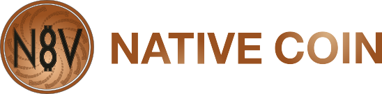

"FIRST OF ITS KIND"

NativeCoin is GNU AGPLv3 licensed.

  
</a> 
                                                                                                                                                     

[Website](https://n8vcoin.io) — [PoS Web Wallet](https://n8vcoin.io) — [Block Explorer](https://explorer.n8vcoin.io//) — [Blog](https://reddit.com/r/N8VCoin) — [Forum](https://bitcointalk.org/index.php?topic=4938083) — [Telegram](https://t.me/NativeCoinOfficial) — [Twitter](https://twitter.com/N8VCOIN)

Features
=============

* Hybrid PoW/PoS algorithm Coming Soon.
* Hybrid masternode
* Static PoS
* Segwit
* Smart contract: Coming Soon
* New PHI2 PoW/PoS hybrid algorithm : Coming soon
* Parallel masternode (PMN)

  * [Banking layer](#)
  
   
    * [DFS Testnet](doc/dfs-testnet.md)
    
* ## Quark PoS algorithm 

The NativeCoin Project is a decentralized peer-to-peer banking financial platform, created under an open source license, featuring a built-in cryptocurrency, end-to-end encrypted messaging and decentralized marketplace. The decentralized network aims to provide anonymity and privacy for everyone through a simple user-friendly interface by taking care of all the advanced cryptography in the background.

The Nativecoin allow for communications among validated blockchain with the ability to perform tasks and advanced functions. Through the use of PMN, N8V is able to interact with many other popular blockchains and create a unifying bond among those ecosystems.

NativeCoin doesn't provide direct support for dapp database. Instead, a mechanism to interact with another Blockchain via N8V'S function where the other Blockchain can send and receive trigger function notices and international data through the NativeCoin network via Masternodes and NativeCoin. Masternodes & NativeCoin can also be used to interact with the centralized services such as bankers. Those centralism services can connect to the Native network for specific trigger of the NativeCoin via The Masternodes. It will allow for their developed autonomous system to act based on their behalf. The Masternodes will then be developed by the connecting Blockchain developer. NativeCoin will have to supply a deployment guide to assist their development. In order to assist the Centralized services, NativeCoin will need to provide a centralized trustworthy environments. So the user has their trusted oversight to verify that the transactions are legitimate.

In addition, without NativeCoin and Masternodes, Bitcoin and Ethereum cannot interact with each other on the same Blockchain because the technology is incompatible. It is almost impossible before our Masternodes and NativeCoin functions are implemented. Therefore, we have to introduce a Smartcontract & Segwit features in the next release to verify that we succeed to combine those different technologies together to create a brand new unique feature of NativeCoin.

## Coin Specifications

| Specification | Value |
|:-----------|:-----------|
| PreMine Total | `21,000,000` |
| Total Blocks | `40,000,000` |
| Block Size | `1MB` |
| Block Time | `60s` |
| PoS Reward | `1 N8V` |
| Stake Time | `1 hours` | 
| Masternode Requirement | `25,000 N8V` |
| Masternode Reward | `80% /PoS` |
| Port | `8848` |
| RPC Port | `8849` |
| Masternode Port | `8848` |
| N8V=v legacy address start with | `N` |
| p2sh-segwit address start with | `n` |
| Bech32 address start with | `bc` |

* NOTE: "getrawchangeaddress p2sh-segwit" to get p2sh-segwit address 

Instructions
-----------
* [N8V-qt](doc/N8V_QT_v5_Win_Mac_User_Guide.pdf)

* [Smart contract](doc/smartcontract.md)

* [Token](doc/Token_Instructionsv2.pdf) (Thanks @Wizard!)

* [DFS Testnet](doc/dfs-testnet.md)

Build N8v wallet
----------

### Building for 32-bit Windows

The next three steps are an example of how to acquire the source and build in an appropriate way.
        
Acquire the source and install dependencies.

    git clone https://github.com/N8VCoin/nativecoin
    sudo chmod -R a+rw n8v
    cd n8v/depends
    ./install-dependencies.sh
    
Set the default mingw-w32 g++ compiler option to auto (option 0) by default.

    sudo update-alternatives --config i686-w64-mingw32-g++
    
Build in the usual way.

    ./build-wins.sh
    
### Building for 64-bit Windows   

The next three steps are an example of how to acquire the source and build in an appropriate way.
        
Acquire the source and install dependencies.

    https://github.com/N8VCoin/nativecoin
    sudo chmod -R a+rw n8v
    cd n8v/depends
    ./install-dependencies.sh
    
Set the default mingw-w64 g++ compiler option to posix (option 1).

    sudo update-alternatives --config x86_64-w64-mingw32-g++
    
Build in the usual way.

    ./build-wins.sh x64

### Build on Ubuntu

Use

    sudo add-apt-repository ppa:bitcoin/bitcoin; git clone https://github.com/N8VCoin/nativecoin; cd n8v; depends/install-dependencies.sh; ./autogen.sh; ./configure --disable-tests --with-boost-libdir=/usr/local/lib; make clean; make -j$(nproc)

Add bitcoin repository for Berkeley DB 4.8

    sudo add-apt-repository ppa:bitcoin/bitcoin

Clone n8v repository

    https://github.com/N8VCoin/nativecoin

Build n8v 

    cd n8v
    ./depends/install-dependencies.sh
    ./autogen.sh
    ./configure --disable-tests
    make -j$(nproc)

### Build on OSX

The commands in this guide should be executed in a Terminal application.
The built-in one is located in `/Applications/Utilities/Terminal.app`.

#### Preparation

Install the OS X command line tools:

`xcode-select --install`

When the popup appears, click `Install`.

If you're running macOS Mojave 10.14/Xcode 10.0 or later, and want to use the depends system, you'll also need to use the following script to install the macOS system headers into /usr/include.

    open /Library/Developer/CommandLineTools/Packages/macOS_SDK_headers_for_macOS_10.14.pkg

Then install [Homebrew](https://brew.sh)

    /usr/bin/ruby -e "$(curl -fsSL https://raw.githubusercontent.com/Homebrew/install/master/install)"

#### Dependencies

    brew install cmake automake berkeley-db4 leveldb libtool boost@1.64 --c++11 --without-single --without-static miniupnpc openssl pkg-config protobuf qt5 libevent imagemagick --with-librsvg

Link boost 1.64

    brew link boost@1.64 --force

#### Build N8vcore

Clone the N8v source code and cd into n8v

        https://github.com/N8VCoin/nativecoin
        cd n8v
        ./building/mac/requirements.sh
        ./building/mac/build.sh

Setup and Build: Arch Linux
-----------------------------------
This example lists the steps necessary to setup and build a command line only, non-wallet distribution of the latest changes on Arch Linux:

    pacman -S git base-devel boost libevent python
    git clone https://github.com/N8VCoin/nativecoin
    cd n8v/
    ./autogen.sh
    ./configure --without-miniupnpc --disable-tests
    make -j$(nproc)

Note:
Enabling wallet support requires either compiling against a Berkeley DB newer than 4.8 (package `db`) using `--with-incompatible-bdb`,
or building and depending on a local version of Berkeley DB 4.8. The readily available Arch Linux packages are currently built using
`--with-incompatible-bdb` according to the
As mentioned above, when maintaining portability of the wallet between the standard Bitcoin Core distributions and independently built
node software is desired, Berkeley DB 4.8 must be used.

ARM Cross-compilation
-------------------
These steps can be performed on, for example, an Ubuntu VM. The depends system
will also work on other Linux distributions, however the commands for
installing the toolchain will be different.

Make sure you install the build requirements mentioned above.
Then, install the toolchain and curl:

    sudo apt-get install g++-arm-linux-gnueabihf curl

To build executables for ARM:

    cd depends
    make HOST=arm-linux-gnueabihf NO_QT=1
    cd ..
    ./configure --prefix=$PWD/depends/arm-linux-gnueabihf --enable-glibc-back-compat --enable-reduce-exports LDFLAGS=-static-libstdc++
    make -j$(nproc)

For further documentation on the depends system see [README.md](../depends/README.md) in the depends directory.

Building on FreeBSD
--------------------

Clang is installed by default as `cc` compiler, this makes it easier to get
started than on [OpenBSD](build-openbsd.md). Installing dependencies:

    pkg install autoconf automake libtool pkgconf
    pkg install boost-libs openssl libevent
    pkg install gmake

You need to use GNU make (`gmake`) instead of `make`.
(`libressl` instead of `openssl` will also work)

For the wallet (optional):

    ./contrib/install_db4.sh `pwd`
    setenv BDB_PREFIX $PWD/db4

Then build using:

    ./autogen.sh
    ./configure BDB_CFLAGS="-I${BDB_PREFIX}/include" BDB_LIBS="-L${BDB_PREFIX}/lib -ldb_cxx"
    gmake

Development Process
-------------------

The `master` branch is regularly built and tested, but is not guaranteed to be
completely stable. [Tags](https://github.com/N8VCoin/nativecointags) are created
regularly to indicate new official, stable release versions of N8V.

The contribution workflow is described in [CONTRIBUTING.md](CONTRIBUTING.md).

Testing
-------

Testing and code review is the bottleneck for development; we get more pull
requests than we can review and test on short notice. Please be patient and help out by testing
other people's pull requests, and remember this is a security-critical project where any mistake might cost people
lots of money.

### Automated Testing

Developers are strongly encouraged to write [unit tests](src/test/README.md) for new code, and to
submit new unit tests for old code. Unit tests can be compiled and run
(assuming they weren't disabled in configure) with: `make check`. Further details on running
and extending unit tests can be found in [/src/test/README.md](/src/test/README.md).

There are also [regression and integration tests](/qa) of the RPC interface, written
in Python, that are run automatically on the build server.
These tests can be run (if the [test dependencies](/qa) are installed) with: `qa/pull-tester/rpc-tests.py`

### Manual Quality Assurance (QA) Testing

Changes should be tested by somebody other than the developer who wrote the
code. This is especially important for large or high-risk changes. It is useful
to add a test plan to the pull request description if testing the changes is
not straightforward.

### Issue

 We try to prompt our users for the basic information We always need for new issues.
 Please fill out the issue template below and submit it to our discord channel
  
 
 [ISSUE_TEMPLATE](doc/template/ISSUE_TEMPLATE_example.md)

## License
